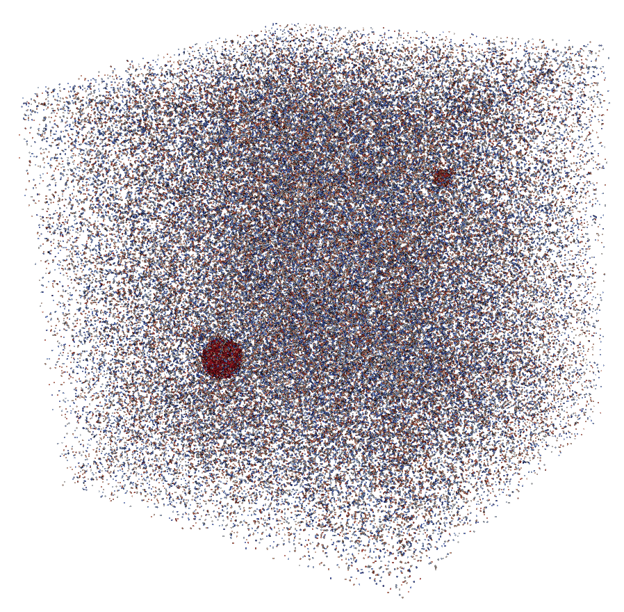
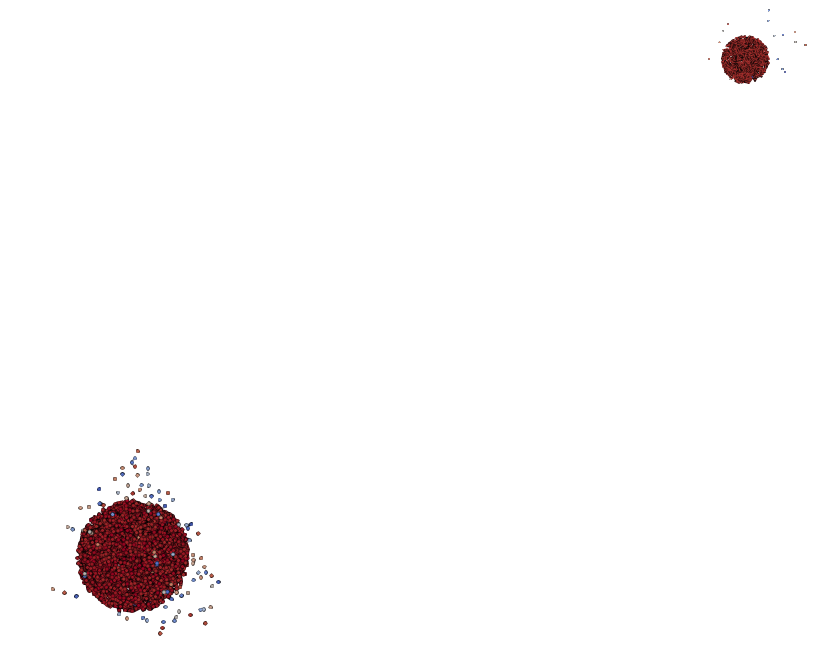

# Rockstar for halo identification and mergers

1. Clone the Rockstar repository and compile

```
1. git clone https://bitbucket.org/pbehroozi/rockstar-galaxies.git
2. cd rockstar-galaxies
3. make -j8
```
This will produce the executable named `rockstar-galaxies`.

To run examples of halo finding with Rockstar, go into one of the example folders in 
`rockstar_example` - `Example1`, `Example 2` or `Example3` and do the following.  
4. Compile and run to generate particle snapshot
```
mpicxx -std=c++14 main.cpp -o out
./out
```
This will generate a binary file in gadget format containing the particles.  
5. `./rockstar-galaxies -c rockstar.cfg <particle-gadget-file>`    
where `<particle-gadget-file>` is the output file produced in step 4. This will produce a folder named 
`halos` with 
- `.ascii` files which contains information of the halos
- `.bin` files which are binary files which contains the particle locations of the halos
- `.rbin` files which collectively contain all the particles in the domain

Note that there will be as many ascii, bin and rbin files as the number of `NUM_WRITERS` in the `.cfg` file. Each `.ascii` file can contain information about more than one halo. The corresponding `.bin` file will contain the particles of that halo. For eg. `halo_0.22.ascii` can contain info of 5 halos, and `halo_0.22.bin` will contain the particle info of those 5 halos.

To visualize all the particles and the halo particles, `.vtk` files can be written
```
7. cd WriteHalosVTK
8. mpicxx -std=c++14 main.cpp -o out
9. ./out <dir that contains .rbin files> <halo .bin file>
```
where `<.bin file>` and `<.rbin file>` are from Step 5. This will write individual `.vtk` files for each of the halo produced and a `all_particles.vtk` file 
for all the particles in the domain.

## `BackgndWithTwoHalo` output

This shows the result of executing the above pipeline for `rockstar_examples/BackgndWithTwoHalo`.

<div align="center">

<table>
<tr>
<td align="center">
<br>
<b>(a)</b> All particles in the simulation volume.
</td>

<td align="center">
<br>
<b>(b)</b> Particles identified as belonging to the halo.
</td>
</tr>
</table>

<i>Figure 3:</i> Rockstar successfully identifies the overdense halo and assigns particles to the halo catalog.

</div>
