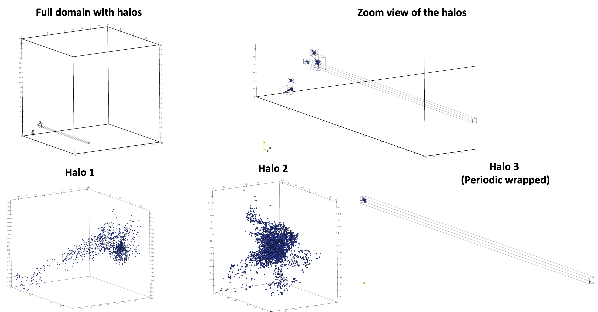

# mpi-rockstar for halo identification and mergers for Nyx simulations

Note: The mpi-rockstar code works only with OpenMPI and not MPICH.

1. Clone the Rockstar repository and compile

```
1. git clone https://github.com/Tomoaki-Ishiyama/mpi-rockstar.git
2. cd mpi-rockstar/src
3. make -j8 mpi-rockstar
```
This will produce the executable named `mpi-rockstar` in the mpi-rockstar directory.

To run examples of halo finding with Rockstar, go into one of the example folders in 
`rockstar_example` - `rockstar_examples/Parallel`

4. Create a .cfg file like the ones provided in this folder
```
INBASE = <directory-containing-gadget-files>
FILENAME = "nyx_snapshot.<snap>.<block>"
NUM_BLOCKS = <number-of-gadget-files-for-each-snapshot>
STARTING_SNAP=0
NUM_SNAPS = <number-of-snapshots>
RESCALE_PARTICLE_MASS = 1
OUTBASE = <output-directory>
```
With the above string for the `FILENAME`, the gadget filenames has to be of the form `nyx_snapshot.5.0`, `nyx_snapshot.5.1` etc., where 5 is the snapshot id and 0, 1 are the block id.

5. Run
`mpirun -np <num_ranks> mpi-rockstar -c <.cfg-file>`
This will write the halo.bin files and halo.ascii files into the `OUTBASE` directory. There will be as many `.bin` and `.ascii` files as the number of MPI ranks.

6. Now, to visualize the halos
```
cd WriteHalosVTK
make -j8
./write_halos_vtk --halo-bin-file=<halo-bin-file> --gadget-files-dir=<directory-containing-gadget-files>
```
For example `halo_0.10.bin` files will contain the locations of all the particles of all halos with center in the processor with rank 10. The above  will write each of those halos into a separte `.vtk` file that can be visualized in ParaView.

## Nyx-mpi-rockstar halo output

This shows the result of executing the above pipeline for Nyx a snapshot with $$256^3$$ particles at a redshift of `z=2.0` on a 20 Mpc/h simulation domain.

<div align="center">

<br>

<i>Figure 3:</i> Halos identified by mpi-rockstar for a redshift of `z=2` snapshot on a 20 Mpc/h simulation domain.

</div>
