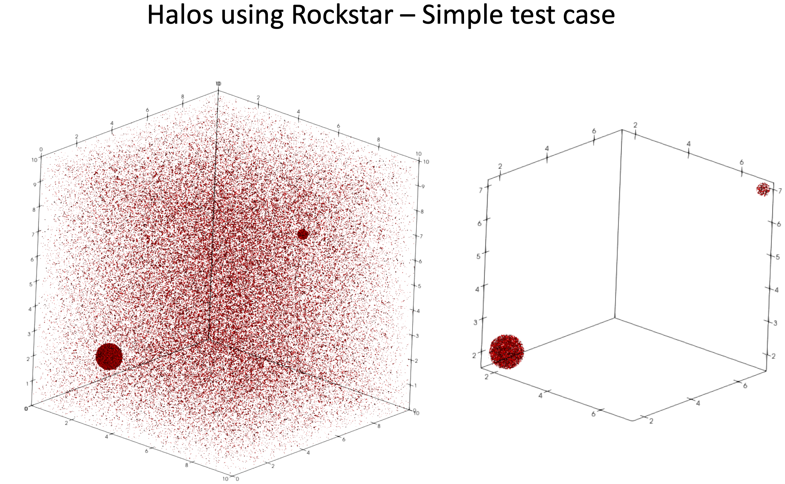

# mpi-rockstar for halo identification for a small test case

Note: The mpi-rockstar code works only with OpenMPI and not MPICH.

1. Clone the Rockstar repository and compile

```
1. git clone https://github.com/Tomoaki-Ishiyama/mpi-rockstar.git
2. cd mpi-rockstar/src
3. make -j8 mpi-rockstar
```
This will produce the executable named `mpi-rockstar` in the mpi-rockstar directory.

To run examples of halo finding with mpi-rockstar for a small test case, go into the example folders in  `rockstar_example`
4. `cd rockstar_examples/Parallel/BackgndWithTwoHalo_Parallel`

5. Run
`mpirun -np <num_ranks> mpi-rockstar -c rockstar.cfg`
This will write the halo.bin files and halo.ascii files into the `halos` directory. There will be as many `.bin` and `.ascii` files as the number of MPI ranks.

6. Now, to visualize the halos
```
cd WriteHalosVTK
make -j8
./write_halos_vtk --halo-bin-file=<halo-bin-file> --gadget-files-dir=<directory-containing-gadget-files>
```
For example `halo_0.1.bin` files will contain the locations of all the particles of all halos with center in the processor with rank 10. The above  will write each of those halos into a separte `.vtk` file that can be visualized in ParaView.

## Test case halo output

Image below shows the result of executing the above pipeline for a simple test snapshot with 125000 particles on a 10 Mpc/h simulation domain.

<div align="center">

<br>

<i>Figure 3:</i> The particle snapshot and the halos identified by mpi-rockstar for the simple test case.

</div>
